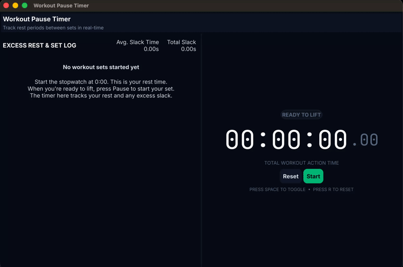

# Workout Pause Timer

A desktop timer (Windows + macOS) for tracking how long you "slack" between
finishing a rest period and actually starting your next set.

Note: This is a less polished version of [this app](https://github.com/1729prashant/workout-timer)



## How it works

- Press **Start** (or `Space`) — the big timer counts up. This is your
  intentional rest period.
- Press **Pause** (or `Space`) when you're ready to start lifting. This
  freezes that rest segment and logs it, and starts a live "slack" counter
  on the left showing how long you take before pressing Start again.
- Press **Resume** — the slack value for that set locks in, the main
  timer resumes counting from where it left off (it does **not** reset to
  zero — it's a running total for the whole session), and a new set begins.
- **Reset** (or `R`) clears everything back to zero.

## Build & run

You'll need Go 1.22+ installed. This app builds with a normal internet
connection — the code fetches [Fyne](https://fyne.io) automatically.

```bash
cd workout-timer
go mod tidy
go run .
```

### macOS

```bash
go build -o WorkoutPauseTimer
./WorkoutPauseTimer
```

Fyne apps need Xcode's command line tools on macOS (`xcode-select --install`)
for the Cgo-based OpenGL bindings — you likely already have these if you do
any dev work.

### Windows

```bash
go build -o WorkoutPauseTimer.exe
```

You'll need a C compiler on your PATH (Fyne uses Cgo). The easiest route is
[MSYS2/MinGW-w64](https://www.fyne.io/started/#windows) — see Fyne's own
Windows setup guide if `go build` complains about a missing `gcc`.

### Cross-compiling (optional)

If you want to build the Windows .exe from your Mac (or vice versa) without
owning both machines, look at
[`fyne-cross`](https://github.com/fyne-io/fyne-cross) — it uses Docker to
cross-compile for both targets from one machine.

### License
See LICENSE.
